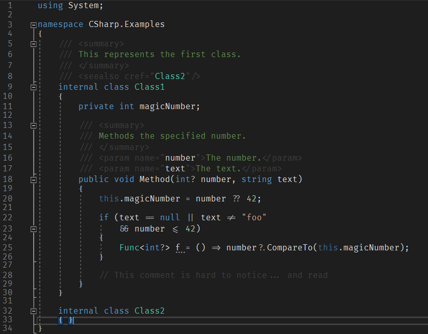

# Visual Studio 2017

## Settings with Custom Dark Theme

- uses [Fira Code](https://github.com/tonsky/FiraCode#fira-code-monospaced-font-with-programming-ligatures)
  - see also [Monospaced Programming Fonts with Ligatures](https://www.hanselman.com/blog/MonospacedProgrammingFontsWithLigatures.aspx)
- custom colored XML comments to reduce noise
- custom colored comments to _almost_ get rid of them
  - as the code should document itself

## TODO Settings with Presentation Theme